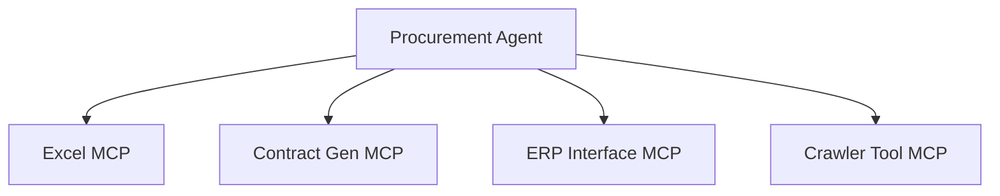
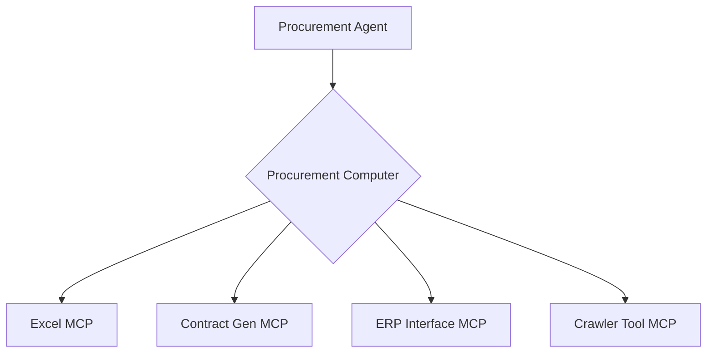
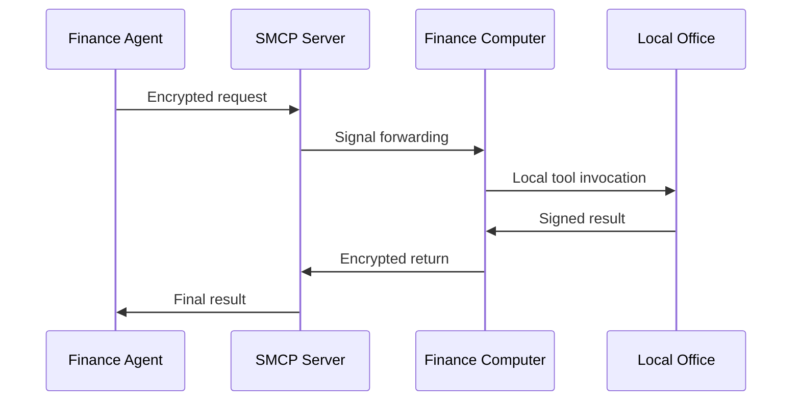
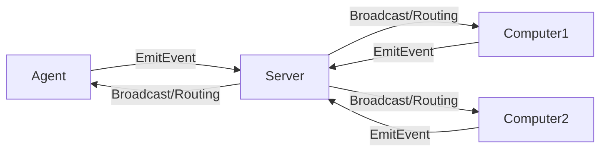
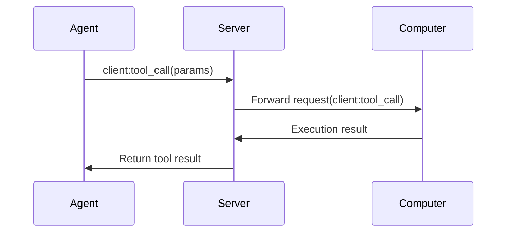
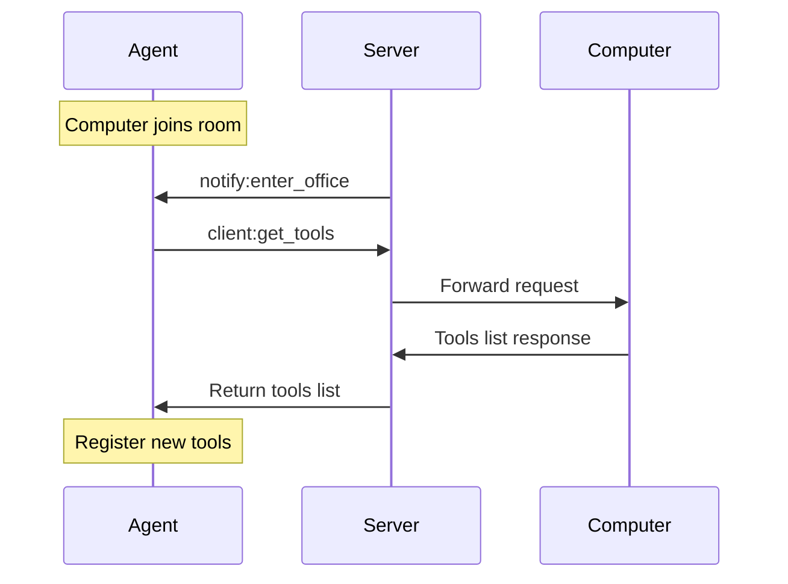

# A2C-SMCP Remote Invocation Protocol (Agent To Computer SMCP)

## 📖 [中文文档](./READMD.zh.md)

- 👉 点击此处跳转至 [中文文档](./READMD.zh.md)

## Design Goals & Background

A2C-SMCP addresses core pain points of the MCP protocol in Agent systems:

1. **Multi-MCP Service Management**  
   Introduces `Computer` concept to unify management of multiple MCP services on a host, simplifying Agent interaction with multiple tool services.

2. **Tool Permission & Security Challenges**  
   - Tool authentication (e.g., token expiration/over-privileging)
   - Certificate management (e.g., Office license ownership)
   - Network dependencies (cross-origin requests, intranet penetration, proxy management)

A2C-SMCP solves key challenges faced by traditional MCP protocols in complex Agent systems. We illustrate the design motivation through two core scenarios:

### Scenario 1: Tool Service Tsunami (Multi-MCP Management Dilemma)
**Example Context**  
A corporate AI team's procurement Agent needs to coordinate:
- Local Excel tools (processing purchase lists)
- Cloud contract generation services
- Internal ERP system interfaces
- Vendor price comparison crawler tools

**MCP Pain Points**  

- 🤯 **Management Black Hole**: Agent must individually maintain each MCP lifecycle
- 💔 **Disconnection Risks**: Crash of any MCP fails entire procurement process
- 🚫 **Resource Waste**: Idle MCPs continuously consume system resources

**SMCP Solution**  

- 🛡️ **Fault Isolation**: Single MCP crash doesn't affect entire Computer
- 📡 **Hot-Plug Support**: Dynamically add/remove tools without Agent restart
- ⚙️ **Unified Monitoring**: Computer internally implements service health checks

---

### Scenario 2: Enterprise Tool Security Dilemma
**Sensitive Tool Cases**  
Finance department requires:
- ⚖️ Local Office for reports (license restrictions)
- 🔑 Bank system access via VPN (2FA)
- 📊 SAP financial module operations (role permissions)

**Traditional MCP Defects**  

| Security Issue | Example Consequence | Frequency |
|----------|----------|----------|
| **Hardcoded Tokens** | Financial token leak → $1M loss | Critical ⚠️ |
| **Public Port Exposure** | SAP interface ransomware attack | Frequent 🔥 |
| **Certificate Conflict** | Shared Office triggers license audit | Medium ⚠️ |

**SMCP Security Architecture**  

Key Protection Layers:
1. 🔐 **Zero Credential Propagation**: Sensitive tokens only exist locally
2. 🌐 **No Public Exposure**: Computers connect via long-lived channels
3. 🏷️ **Device Binding**: Office licenses bound to specific hardware

---

### Core Solutions

| Problem Type | A2C-SMCP Solution |
|---------|-----------------|
| **Multi-Service Mgmt** | Computer abstraction layer aggregates MCP services |
| **Permission Security** | Room isolation + role binding |
| **Network Penetration** | Socket.IO long connections + signaling server |
| **Certificate Mgmt** | Computer-bound physical device ownership |

## Protocol Foundation

### Role Definitions

| Role | Quantity Limit | Description | Connection Properties |
|------|---------|------|---------|
| **Computer** | Multiple (≥1) | Tool service provider (MCP host) | Single-room binding |
| **Agent** | 1 per room | Tool invocation initiator | Multi-room support |
| **Server** | 1 | Signaling server (connection mgmt + message routing) | Global hub |

### Core Interaction Model


### Namespace Design
```python
# Core protocol namespace
SMCP_NAMESPACE = "/smcp"

# Event category rules:
# client:  Agent→Computer execution
# server:  Client→Server processing
# notify:  Server→Broadcast
```

## Room Mechanism

### Room Management Rules

1. **Room Identification**  
   `office_id` = `robot_id` (ensures global uniqueness)
   
2. **Join Process**  
   ```mermaid
   sequenceDiagram
       participant C as Computer/Agent
       participant S as Server
       C->>S: server:join_office
       S->>S: Verify role permissions
       alt Verification passed
           S->>C: Join room
           S->>Room: notify:enter_office
       else Verification failed
           S->>C: Return error
       end
   ```

3. **Member Change Notifications**

   ```python
   # Join notification structure
   class EnterOfficeNotification(TypedDict, total=False):
       office_id: str
       computer: Optional[str]  # New Computer
       agent: Optional[str]     # New Agent

   # Leave notification structure
   class LeaveOfficeNotification(TypedDict, total=False):
       office_id: str
       computer: Optional[str]  # Departing Computer
       agent: Optional[str]     # Departing Agent
   ```

### Isolation Mechanisms

| Restriction Type | Trigger Condition | Server Response |
|---------|---------|-----------|
| **Agent Exclusivity** | New Agent joins occupied room | `Agent sid should equal office_id` |
| **Computer Binding** | Computer attempts to join new room | Auto-disconnect from old room |
| **Permission Boundary** | Cross-room access attempts | Auto-reject routing |

## Message Protocol Specification

### Event Taxonomy

| Category | Prefix | Direction | Example |
|------|------|------|------|
| **Tool Operations** | `client:` | Agent→Computer | `client:tool_call` |
| **Room Management** | `server:` | Client→Server | `server:join_office` |
| **Status Notifications** | `notify:` | Server→Broadcast | `notify:enter_office` |

### Core Events

| Event Name | Initiator | Description | Data Structure |
|---------|----------------|------|----------|
| `client:tool_call` | Agent | Tool invocation request | `ToolCallReq` |
| `client:get_mcp_config` | Agent | Get MCP configuration | `GetMCPConfigReq` |
| `client:get_tools` | Agent | Get tools list | `GetToolsReq` |
| `server:join_office` | Computer/Agent | Join room request | `EnterOfficeReq` |
| `server:leave_office` | Computer/Agent | Leave room request | `LeaveOfficeReq` |
| `server:update_mcp_config` | Computer | Update MCP config | `UpdateMCPConfigReq` |
| `server:tool_call_cancel` | Agent | Cancel tool call | `ToolCallCancelReq` |
| `notify:tool_call_cancel` | Server | Tool cancellation notice | `ToolCallCancelNotification` |
| `notify:enter_office` | Server | Member join notice | `EnterOfficeNotification` |
| `notify:leave_office` | Server | Member leave notice | `LeaveOfficeNotification` |
| `notify:update_mcp_config` | Server | Config update notice | `UpdateMCPConfigNotification` |

### Core Data Structures

```python
# Tool invocation request
class ToolCallReq(TypedDict):
    robot_id: str     # Agent ID
    req_id: str       # Request UUID
    computer: str     # Target Computer
    tool_name: str    # Tool name
    params: dict      # Parameters
    timeout: int      # Timeout (seconds)

# MCP configuration
class MCPServerConfig(TypedDict):
    type: Literal["stdio", "http", "sse"]
    url: NotRequired[str]          # Required for HTTP/SSE
    command: NotRequired[str]      # Required for CLI mode
    disabled: bool                # Disabled flag
    tool_meta: dict[str, dict]    # Tool metadata
```

## Core Workflows

### Tool Invocation Flow


### Dynamic Tool Discovery


## Error Handling (TODO | Under Discussion)

### Error Codes

| Code | Meaning | Trigger Scenario |
|------|------|---------|
| 400 | Invalid request format | Data validation failure |
| 403 | Permission violation | Role conflict |
| 404 | Resource not found | Tool/Computer missing |
| 408 | Request timeout | Operation timeout |
| 500 | Internal error | Server exception |

### Error Response Format
```python
{
  "error": {
    "code": 404,
    "message": "Requested tool not found",
    "details": {
      "toolId": "invalid-tool-id"
    }
  }
}
```

## Implementation Architecture (Python Example)

### Server Architecture
```python
class SMCPNamespace(TFRSNamespace):
    async def on_server_join_office(self, sid, data):
        # Implement room joining logic
        
    async def on_client_tool_call(self, sid, data):
        # Route tool invocation requests
        
    async def enter_room(self, sid, room):
        # Core room joining implementation
        if role == "agent":
            # Agent single-room validation
        else:
            # Computer room switching
```

### Agent Client
```python
class SMCPAgentClient(Client):
    def emit_tool_call(self, computer, tool_name, params, expires):
        # Send tool invocation request
        
    def on_computer_enter_office(self, data):
        # Handle new Computer notification
        # Auto-fetch and register tools
        
    def on_computer_update_mcp_config(self, data):
        # Handle config updates
        # Refresh toolset
```

## Protocol Advantages

1. **Tool Hot Management**  
   - Dynamic discovery/registration
   - Hot config updates

2. **Security Isolation**  
   - 1:1 Agent-Computer binding
   - Room-based permission boundaries

3. **Network Optimization**  
   - Socket.IO long connections
   - No public IP dependency

4. **Elastic Architecture**  
   - Multi-Computer support
   - Distributed tool deployment

5. **Standardized Interface**  
   - Strongly-typed data
   - Clear event boundaries

## Appendix: Complete Event List

| Event Name | Direction | Description | Data Structure |
|----------|-------|--------|---------|
| `client:tool_call` | A→C | Tool invocation | `ToolCallReq` |
| `client:get_tools` | A→C | Get tools list | `GetToolsReq` |
| `client:get_mcp_config` | A→C | Get MCP config | `GetMCPConfigReq` |
| `server:join_office` | A/C→S | Join room | `EnterOfficeReq` |
| `server:leave_office` | A/C→S | Leave room | `LeaveOfficeReq` |
| `server:update_mcp_config` | C→S | Update config | `UpdateMCPConfigReq` |
| `notify:tool_call_cancel` | S→Broadcast | Cancel tool call | `AgentCallData` |
| `notify:enter_office` | S→Broadcast | Member join | `EnterOfficeNotification` |
| `notify:leave_office` | S→Broadcast | Member leave | `LeaveOfficeNotification` |


## Roadmap

- Implement error handling patterns
- Add MCP Resources management for Agent usage
- Implement MCP Prompts management
- Integrate with OpenTelemetry to connect A2C-SMCP call chains with user request traces